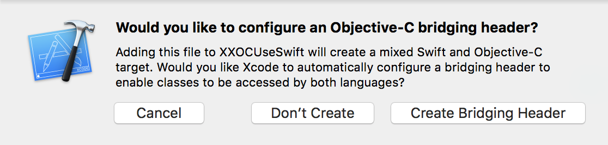
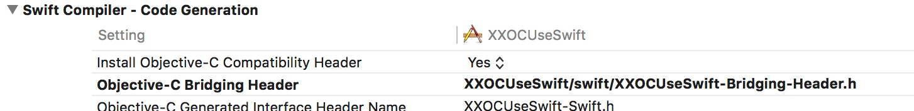
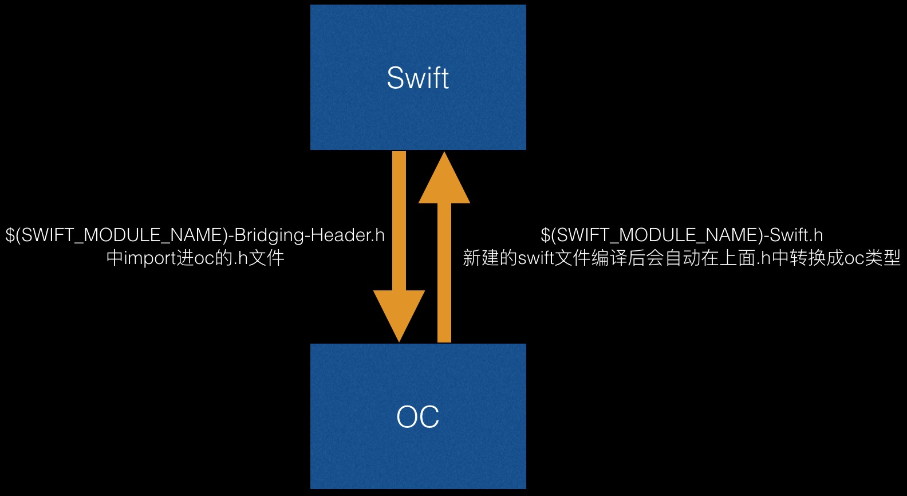
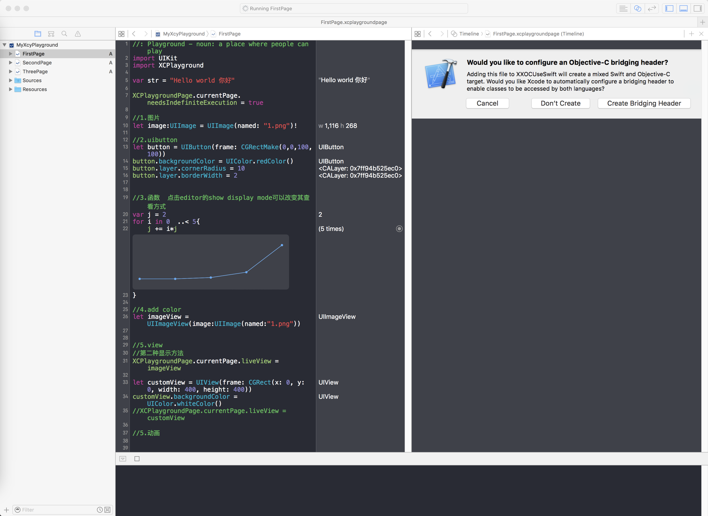

##从OC到swift的深入浅出
swift的基础语法相信大家都看过很多,这里有最全的资料:[swift官网](https://developer.apple.com/swift/),这里讲的是swift2.2。网上有一句很有意思的话:  

**C，C++， Objective ，Swift 但就像《葫芦娃》里面七个兄弟中的四个一样牛掰，七葫芦娃是最厉害的，但需要七个兄弟齐心协力才能收妖**  

### 一. 建立工程  

  
选择Create Brideing Header  

  

这里我自己用keyNote画了一个图  

  

当然，没有demo的例子完全在耍流氓，大家稍后看一下最后一页的demo附录,可以点击下载,这里贴一下代码  

在OSMOView.m中:    

```objc
@implementation OSMOView

-(void) print
{
    NSLog(@"testXXX");
}
```  

在ViewController.m中:    

```objc
@implementation ViewController

- (void)viewDidLoad {
    [super viewDidLoad];
    XXSwiftViewController *swiftVC = [[XXSwiftViewController alloc] init];
    [swiftVC printOSMOView];
}
```  

在XXSwiftViewController中:  

```objc
class XXSwiftViewController: UIViewController {
    
    override init(nibName nibNameOrNil: String?, bundle nibBundleOrNil: NSBundle?) {
        super.init(nibName: nibNameOrNil, bundle: nibBundleOrNil)
    }

    required init?(coder: NSCoder) {
        super.init(coder: coder)
        printOSMOView();
    }
    
    func printOSMOView() -> Void {
        let osmoView:OSMOView = OSMOView()
        osmoView.print();
    }
    
}
```


### 二. 与Objective-C的API交互
#### 1. 初始化
在oc中:  

```objc
- (instancetype)init;
- (instancetype)initWithFrame:(CGRect)frame
                        style:(UITableViewStyle)style;
```

在swift中:   

```objc 
init() { /* ... */ }
init(frame: CGRect, style: UITableViewStyle) { /* ... */ }
```
统一都是`init(`开头，然后里面加参数，更加统一化  

#### 2. 实例化对象
在oc中:

```objc
UITableView *myTableView = [[UITableView alloc] initWithFrame:CGRectZero style:UITableViewStyleGrouped];
```

在swift中:   

```objc
let myTableView: UITableView = UITableView(frame: CGRectZero, style: .Grouped)
```
去掉了`alloc`和`init`，在使用工厂方法的时候,swift统一做了更好的处理,将其直接映射到了swift的初始化方法:  

在oc中:  

```objc
UIColor *color = [UIColor colorWithRed:0.5 green:0.0 blue:0.5 alpha:1.0];
```

在swift中:  

```objc
let color = UIColor(red: 0.5, green: 0.0, blue: 0.5, alpha: 1.0)
```

#### 3. 访问属性
在oc中:  

```objc
[UIColor darkGrayColor];
textfield.text = @"test";
```  

在swift中:  

```objc
UIColor.darkGrayColor()
myTextField.text = "Hello world"
```
当获取或设置属性的时候，只需要写属性的名字，不需要写括号。但要注意darkGrayColor包含了一个括号。这是因为darkGrayColor是UIColor的一个类方法，不是一个属性  

#### 4. 使用方法
在oc中:  

```objc
[myTableView insertSubview:mySubview atIndex:2];
```  

在swift中:  

```objc
myTableView.insertSubview(mySubview, atIndex: 2)
myTableView.layoutIfNeeded() //不带参数
```
属性和方法都是一个宗旨，将`()`进行到底  

#### 5. id 兼容性
##### 5.1 基本用法
Swift 包含一个叫做 AnyObject 的协议类型，它代表任何类型的对象，就像 Objective-C 中的 id 一样。还能在不进行强制类型转换的情况下调用任何 Objective-C 的方法和访问任何的属性。这包含用 @objc 属性标记的 Objective-C 兼容方法,在swift中:  

```objc
var myObject: AnyObject = UITableViewCell()
myObject = NSDate()

let futureDate = myObject.dateByAddingTimeInterval(10)
let timeSinceNow = myObject.timeIntervalSinceNow
```
**注意:crash!**  

```objc
myObject.characterAtIndex(5)
// crash, myObject doesn't respond to that method
```
因为只有在运行时 AnyObject 类型的对象里面的具体类型才会明确，这样就很容以写出不安全的代码。另外，和 Objective-C 比起来，如果你调用了 Anyobject 中不存在的方法或属性，就会产生运行时错误。例如，如下代码不会产生编译错误，但会在运行时出现未定义的方法错误。
可用用Optional开消除错误  

```objc
let myCount = myObject.count
let myChar = myObject.characterAtIndex?(5)
print("\(myCount),\(myChar)") //结果 nil,nil
``` 

##### 5.2 向下转型 
可以检测这个 optional 值来决定类型转换是否成功  

```objc
let userDefaults = NSUserDefaults.standardUserDefaults()
let lastRefreshDate: AnyObject? = userDefaults.objectForKey("LastRefreshDate")
if let date = lastRefreshDate as? NSDate {
    print("\(date.timeIntervalSinceReferenceDate)")
}
```
**注意:crash**  

```objc
let date = lastRefreshDate as! NSDate
```
as! 转换类型不对的话就crash,记住类型不确定了时候为了避免crash最好用 as?  

#### 6. Extension扩展
Swift 中的 Extension Objective-C 的 Category 类似。Extension 扩展了现存的**类，结构体，枚举**的行为，包括那些在 Objective-C 中定义的。你可以在系统框架或是你自定义的类型上定义 Extension。只需要简单的导入相应的模块，并且引用你在 Objective-C 中同样的类，结构体和枚举名称。

```objc
extension UIBezierPath {
    convenience init(triangleSideLength: Float, origin: CGPoint) {
        self.init()
        let squareRoot = Float(sqrt(3.0))
        let altitude = (squareRoot * triangleSideLength) / 2
        moveToPoint(origin)
        addLineToPoint(CGPoint(x: CGFloat(triangleSideLength), y: origin.x))
        addLineToPoint(CGPoint(x: CGFloat(triangleSideLength) / 2, y: CGFloat(altitude)))
        closePath()
    }
}
protocol SomeProtocol {
    var mustBeSettable: Int { get set }
}

extension CGRect:SomeProtocol {
    var area: CGFloat {
        return width * height
    }
    var mustBeSettable: Int { get{ return 10} set{} }
    
}
func testExtern() -> Void {
    let testPath:UIBezierPath = UIBezierPath.init(triangleSideLength: 1.0, origin: CGPointMake(5, 10))
    print("\(testPath)")
    
    let rect = CGRect(x: 0.0, y: 0.0, width: 10.0, height: 50.0)
    let area = rect.area
    print("\(area)")
}

<UIBezierPath: 0x7f9e44857b90; <MoveTo {5, 10}>,
 <LineTo {1, 5}>,
 <LineTo {0.5, 0.86602538824081421}>,
 <Close>
500.0
```

#### 7. Closure
函数闭包：block，在oc中:  

```objc
void (^completionBlock)(NSData *, NSError *) = ^(NSData *data, NSError *error) {/* ... */}
```   

在swift中:

```objc
func testConclusure() -> Void {
    let completionBlock: (String, NSError?) -> Void = {str, error in
        print("\(str)")
    }
    completionBlock("5", nil)
}
```
#### 8. @objc更改暴露給oc的方法等
比如现在在swift中我们是这么写的:  

```objc
@objc(Color)
enum AppColor: Int {
    @objc(Red)
    case KRedColor
    
    @objc(Black)
    case KBlackColor
}

@objc(GameSwfitItem)
class Apple:NSObject{
    @objc(color)
    var appColor: AppColor = .KRedColor
    
    @objc(swiftName)
    var name: String
    
    @objc(initSwift:)
    init(name:String){
        self.name = name
    }
}
```

在｀项目工程名-swift.h`中，我们看到的是这样：  

```objc
SWIFT_CLASS_NAMED("Apple")
@interface GameSwfitItem : NSObject
@property (nonatomic, copy) NSString * _Nonnull swiftName;
- (nonnull instancetype)initSwift:(NSString * _Nonnull)name OBJC_DESIGNATED_INITIALIZER;
@end
```

#### 9. 轻量级范型
在`oc`中:  

```objc
@property NSArray<NSDate *>* dates;
@property NSSet<NSString *>* words;
@property NSDictionary<KeyType: NSURL *, NSData *>* cachedData;
```

在`swift`中:

```objc
var dates: [NSDate]
var words: Set<String>
var cachedData: [NSURL: NSData]
```

#### 10. #selector
**1.給对象增加｀Target`**  

```objc
import UIKit
class MyViewController: UIViewController {
    let myButton = UIButton(frame: CGRect(x: 0, y: 0, width: 100, height: 50))
    
    override init(nibName nibNameOrNil: String?, bundle nibBundleOrNil: NSBundle?) {
        super.init(nibName: nibNameOrNil, bundle: nibBundleOrNil)
        
        let action = #selector(MyViewController.tappedButton(_:))
        myButton.addTarget(self, action: action, forControlEvents: .TouchUpInside)
    }
    
    func tappedButton(sender: UIButton!) {
        print("tapped button")
    }
    
    required init?(coder: NSCoder) {
        super.init(coder: coder)
    }
}
```  

**2.performSelector / respondsToSelector**

```objc
let string: NSString = "Hello, Cocoa!"
let selector = #selector(NSString.lowercaseStringWithLocale(_:))
let locale = NSLocale.currentLocale()
if let result = string.performSelector(selector, withObject: locale) {
    print(result.takeUnretainedValue())
}
// Prints "hello, cocoa!"
```

如果此时没有respondsToSelector,会导致崩溃  

```objc
let array: NSArray = ["delta", "alpha", "zulu"]
    
// Not a compile-time error because NSDictionary has this selector.
let selector = #selector(NSDictionary.allKeysForObject(_:))
    
if array.respondsToSelector(selector){
    array.performSelector(selector)
}
        
```

### 三. 使用Objective-C特性编写Swift类
#### 1. 协议,Class

```objc
class XXTableViewController: UIViewController,UITableViewDelegate,UITableViewDataSource{
    
    lazy var tableView: UITableView! = {
        var tableView = UITableView(frame: CGRectZero, style: UITableViewStyle.Grouped)
        tableView.delegate = self
        tableView.dataSource = self
        tableView.registerClass(UITableViewCell.classForCoder(), forCellReuseIdentifier: "Cell")
        return tableView
    }()
    
    //MARK: UITableViewDelegate
    func numberOfSectionsInTableView(tableView: UITableView) -> Int {
        return 1
    }
    
    func tableView(tableView: UITableView, numberOfRowsInSection section: Int) -> Int {
        return 10
    }
    
    func tableView(tableView: UITableView, cellForRowAtIndexPath indexPath: NSIndexPath) -> UITableViewCell {
        let cell = tableView.dequeueReusableCellWithIdentifier("Cell", forIndexPath: indexPath)
        return cell
    }
}
```  

**lazy**:  
在oc中的
```objc
@property (nonatomic, copy) NSString *testString;

// ClassA.m
- (NSString *)testString {
     if (!_testString) {
         _testString = @"Hello";
        NSLog(@"只在首次访问输出");
     }
     return _testString;
}
```
在`swift`中:  
```objc
class ClassA {
    lazy var str: String = {
        let str = "Hello"
        print("只在首次访问输出")
        return str
    }()
}
```
更深层次理解:  

```objc
let data = 1...3
let result = data.lazy.map {
    (i: Int) -> Int in
    print("正在处理 \(i)")
    return i * 2
}

print("准备访问结果")
for i in result {
    print("操作后结果为 \(i)")
}

print("操作完毕")
此时的运行结果：

// 准备访问结果
// 正在处理 1
// 操作后结果为 2
// 正在处理 2
// 操作后结果为 4
// 正在处理 3
// 操作后结果为 6
// 操作完毕
```

### 四. 看OC/Swift的混用需要注意的点
#### 1. 对象比较
对象比较：
在纯swift中用 == 判等  

```objc
class TodoItem {
    let uuid: String
    var title: String
    
    init(uuid: String, title: String) {
        self.uuid = uuid
        self.title = title
    }
}

extension TodoItem: Equatable {
    
}

func ==(lhs: TodoItem, rhs: TodoItem) -> Bool {
    return lhs.uuid == rhs.uuid
}
//参考::http://swifter.tips/equal/
```  

如果和oc对象做比较，还是需要重写isEqual方法  

```objc
class TodoItemOC :NSObject{
    let uuid: String
    var title: String
    
    init(uuid: String, title: String) {
        self.uuid = uuid
        self.title = title
    }
    
    override func isEqual(object: AnyObject?) -> Bool {
        return true;
    }
}
```

#### 2. 类型兼容
##### 2.1 是否继承NSObject或者oc的类
当你定义的 Swift 类继承自 NSObject 或者其他 Objective-C 类的时候，这个类就自动与 Objective-C 兼容。所有相关这一切的步骤都已经由 Swift 编译器帮你完成。 
在`Persion.swift`中:  

```objc
class Person: NSObject {
    var name : String
    var age : Int
    
    // 重写了NSObject(父类)的构造方法
    override init() {
        name = "testname"
        age = 0
    }
    
    func printName() -> Void {
        print("\(name)")
    }
}
```  

在`oc`中:  

```objc
//
//  Squirrel.m
//  XXSwiftUseOC
//
//  Created by tomxiang on 7/30/16.
//  Copyright © 2016 tomxiang. All rights reserved.
//

#import "Squirrel.h"
#import "XXSwiftUseOC-Swift.h"

@implementation Squirrel

-(void) print{
    Person *person = [[Person alloc] init];
    [person printName];
}
@end
```

#### 3. swift/C++
苹果官网有一句话:  
You cannot import C++ code directly into Swift. Instead, create an Objective-C or C wrapper for C++ code.  
swift无法直接用c++，需要用oc或者c进行包装

##### 1.swift调用c
```objc
//
//  CFile.c
//  XXSwiftUseOC
//
//  Created by tomxiang on 8/4/16.
//  Copyright © 2016 tomxiang. All rights reserved.
//

#include <stdio.h>
void testc()
{
    printf("CFile\n");
}
```

##### 2.swift调用c++
.h中:  

```objc
#ifndef junk_h
#define junk_h

class A
{
public:
    A(int);
    int getInt();
private:
    int m_Int;
};

#endif /* junk_h */
```  

.cpp中:  

```objc
#include "junk.h"

A::A(int _i) : m_Int(_i) {}

int A::getInt() { return m_Int; }

extern "C" int getIntFromCPP()
{
    // Create an instance of A, defined in
    // the library, and call getInt() on it:
    return A(1234).getInt();
}
```  

-bridging-Header中:  

```objc

#import "Squirrel.h"

void testc();

int getIntFromCPP();
```  

一切完成后，即可顺利调用  

#### 4. 本地化
如果是swift工程,可以这样  

```objc
let format = NSLocalizedString("Hello, %@!", comment: "Hello, {given name}!")
let name = "Mei"
let greeting = String(format: format, arguments: [name])
print(greeting)
```
如果是非swift工程,需要用`oc`宏的转换  

```objc
+(NSString*) GET_LOCALIZED_TEXT:(NSString*)inputKey COMMENT:(NSString*)comment;

+(NSString*) GET_LOCALIZED_TEXT:(NSString*)inputKey COMMENT:(NSString*)comment {
    return NSLocalizedString(inputKey, comment);
}
```  

#### 5. 宏
swift中没有宏，那么在纯`swift`中:  

```objc
class Constants {
    static let BEZEL_COLOR = UIColor.init(red: 0, green: 0, blue: 0, alpha:0.8)
    static let TEXT_COLOR = UIColor.init(red: 1, green: 1, blue: 1, alpha: 1)
    static let MARGIN: CGFloat = 15.0
}
hud.bezelView.color = Constants.BEZEL_COLOR
```  

在混用工程中:  

```objc
#define ContinuousViewWidth  190
#define ContinuousViewHeight 60

@interface OSMODefineSwitch : NSObject
+(CGFloat) OSMO_ICON_WIDTH_SWIFT;
```

#### 6. CoreFoundation
[http://swifter.tips/toll-free/](http://swifter.tips/toll-free/),已经写的非常完整了.  
大概的意思就是除掉了CFRelease,CFRetain等，CFFundation对象已经变成ARC了.     
有一点例外，那就是对于非系统的 CF API (比如你自己写的或者是第三方的)，因为并没有强制机制要求它们一定遵照 Cocoa 的命名规范，所以贸然进行自动内存管理是不可行的。如果你没有明确地使用上面的标注来指明内存管理的方式的话，将这些返回 CF 对象的 API 导入 Swift 时，它们的类型会被对对应为 Unmanaged<T>  

```objc
// CFGetSomething() -> Unmanaged<Something>
// CFCreateSomething() -> Unmanaged<Something>
// 两者都没有进行标注，Create 中进行了创建

let unmanaged = CFGetSomething()
let something = unmanaged.takeUnretainedValue()
// something 的类型是 Something，直接使用就可以了

let unmanaged = CFCreateSomething()
let something = unmanaged.takeRetainedValue()

// 使用 something

//  因为在取值时 retain 了，使用完成后进行 release
unmanaged.release()
```  
切记，这些只有在没有标注的极少数情况下才会用到，如果你只是调用系统的 CF API，而不会去写自己的 CF API 的话，是没有必要关心这些的  

### 五. 数据类型 
#### 1. 字符串
为了允许字符串转换，只需导入Foundation框架  

```objc
class XXCocoaSwift: NSObject {
    
    let myString: NSString = "123"
    override init() {
        super.init()
        self.testNSString()
    }
    
    func testNSString() -> Void {
        if let integerValue = Int(myString as String) {
            print("\(myString) is the integer \(integerValue)")
        }
    }
}
//print 123 is the integer 123
```

#### 2. 数值
Swift会自动将已确定的数值类型转换为NSNumber  
```objc
Int
UInt
Float
Double
Bool
```

#### 3. 集合类
Swift 会自动将NSArray、NSSet和NSDictionary类转换为Swift里等价的类：Array、Set和Dictionary
##### 1. Array
```objc
@property NSArray<NSDate *>* dates;
- (NSArray<NSDate *> *)datesBeforeDate:(NSDate *)date;
- (void)addDatesParsedFromTimestamps:(NSArray<NSString *> *)timestamps;
```  

在swift中:  

```objc
var dates: [NSDate]
func datesBeforeDate(date: NSDate) -> [NSDate]
func addDatesParsedFromTimestamps(timestamps: [String])
```

##### 2. Set  
```objc
@property NSSet<NSString *>* words;
- (NSSet<NSString *> *)wordsMatchingPredicate:(NSPredicate *)predicate;
- (void)removeWords:(NSSet<NSString *> *)words;
```  

那么，转换为Swift，则是这个样子的：  

```objc
var words: Set<String>
func wordsMatchingPredicate(predicate: NSPredicate) -> Set<String>
func removeWords(words: Set<String>)
```

##### 3. NSDictionary

```objc
@property NSDictionary<NSURL *, NSData *>* cachedData;
- (NSDictionary<NSURL *, NSNumber *> *)fileSizesForURLsWithSuffix:(NSString *)suffix;
- (void)setCacheExpirations:(NSDictionary<NSURL *, NSDate *> *)expirations;
```  

那么,转换成swift是:  

```objc
var cachedData: [NSURL: NSData]
func fileSizesForURLsWithSuffix(suffix: String) -> [NSURL: NSNumber]
func setCacheExpirations(expirations: [NSURL: NSDate])
```

#### 4. 枚举
```objc
@objc public enum CustomError: Int, ErrorType {
    case A, B, C
}
```  

如果不按照上面这么些，oc将无法应用swift的枚举  

```objc
typedef SWIFT_ENUM(NSInteger, CustomError) {
  CustomErrorA = 0,
  CustomErrorB = 1,
  CustomErrorC = 2,
};
static NSString * _Nonnull const CustomErrorDomain = @"XXSwiftUseOC.CustomError";
```

### 六. playground实时显示 
1.建议参考目录的2，官方文档。这里介绍的一点的`XCPlaygroundPage.currentPage.liveView`设置  

```objc
//: Playground - noun: a place where people can play
import UIKit
import XCPlayground

var str = "Hello world 你好"

XCPlaygroundPage.currentPage.needsIndefiniteExecution = true

//1.图片
let image:UIImage = UIImage(named: "1.png")!

//2.uibutton
let button = UIButton(frame: CGRectMake(0,0,100,100))
button.backgroundColor = UIColor.redColor()
button.layer.cornerRadius = 10
button.layer.borderWidth = 2


//3.函数  点击editor的show display mode可以改变其查看方式
var j = 2
for i in 0  ..< 5{
    j += i*j
}

//4.add color
let imageView = UIImageView(image:UIImage(named:"1.png"))


//5.view
//第二种显示方法
XCPlaygroundPage.currentPage.liveView = imageView

let customView = UIView(frame: CGRect(x: 0, y: 0, width: 400, height: 400))
customView.backgroundColor = UIColor.whiteColor()
//XCPlaygroundPage.currentPage.liveView = customView

//5.动画
```



### 七. 参考目录
1.[swift2.2官方](https://developer.apple.com/library/ios/documentation/Swift/Conceptual/Swift_Programming_Language/TheBasics.html#//apple_ref/doc/uid/TP40014097-CH5-ID309)  
2.[playGround官方](https://developer.apple.com/library/ios/recipes/Playground_Help/Chapters/CreateAndEdit.html#//apple_ref/doc/uid/TP40015166-CH36-SW1)  
3.[Using Swift with Cocoa and Objective-C (Swift 2.2)
](https://developer.apple.com/library/ios/documentation/Swift/Conceptual/BuildingCocoaApps/InteractingWithObjective-CAPIs.html#//apple_ref/doc/uid/TP40014216-CH4-ID35)  
4.[15 Tips to Become a Better Swift Developer
](http://savvyapps.com/blog/swift-tips-for-developers)  
5.[Using Swift with Cocoa and Objective-C 中文版](https://github.com/CocoaChina-editors/Welcome-to-Swift/tree/master/Using%20Swift%20with%20Cocoa%20and%20Objective-C/02Interoperability)  
6.[Swift项目兼容Objective-c问题汇总](http://00red.com/blog/2015/06/02/swift-objectivec-compatible/)   
7.[swiftgg](http://swift.gg/)  
8.[CoreFoundation需要注意的点](http://joywek.com/blog/2016/07/18/five-things-about-corefoundation/)  
9.[swift2.2中文版](https://github.com/numbbbbb/the-swift-programming-language-in-chinese)  

### 八. Demo下载
1.[Demo](https://github.com/xcysuccess/Note2016/tree/master/swiftOC)